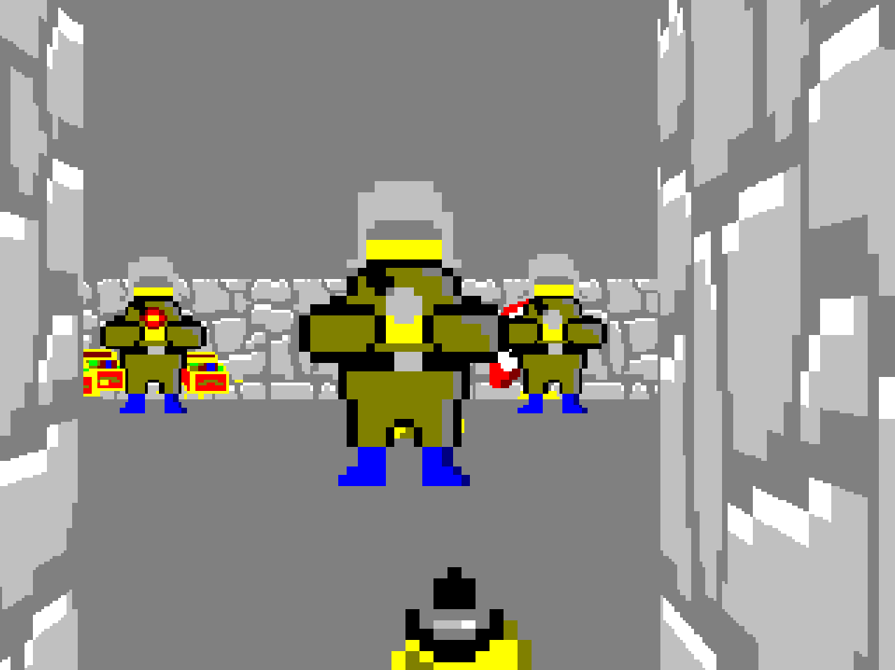

# First Person Shooter

This project is a small First Person Shooter Engine demonstration, done entirely within my own, modified and slightly improved  version of the Console Game Engine. The idea for this was primarily taken from javidx9's FPS Series on YouTube, but I wanted to extend this project into a full remake of the very first episode of Wolfenstein 3D, with the exception of a few enemy and texture types.

At the point of releasing the source code it has been almost a year since I originally wrote this little game, and the main reason for such a delay is rather simple - I wasn't satisfied with how the source code ended up looking. In hindsight, there are many things that I would change, but I have no plans of rewriting this, so I decided to share the code either way.